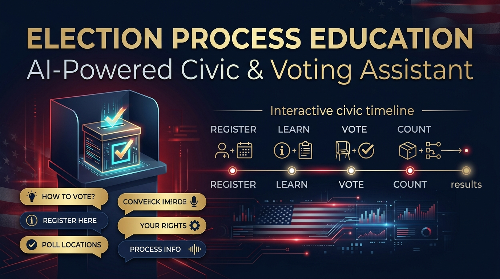

# 🗳️ Election Process Education: AI-Powered Civic & Voting Assistant

[](https://hack2skill.com)
[]()
[](https://developers.google.com)
[](https://www.anthropic.com)
[](https://nextjs.org/)
[](https://developers.google.com/civic-information)
[](LICENSE)

<p align="center">
  
</p>

> **An Interactive, Nonpartisan Civic Education Assistant and Real-Time Voting Roadmap**  
> *Developed & Vibe-Coded during the PromptWars April 2026 Hackathon by Hack2Skill & Google for Developers.*

---

## 📌 Executive Summary

Democratic elections can be intimidating and confusing—especially for first-time voters, naturalized citizens, and young adults navigating complex registration deadlines, voter ID mandates, and the Electoral College system. Official government election websites are often fragmented across disparate state portals, dense legal prose, and static PDF guides.

**Election Process Education** solves this civic engagement challenge. Built as an AI-powered conversational civic tutor, the platform demystifies voting procedures through **streaming natural language dialogues**, **nonpartisan AI guardrails**, and **live civic data feeds from Google's Civic Information API**. Users receive personalized voting deadlines, polling station lookups, and clear explanations of democratic processes in plain language.

---

## 🎯 Hackathon Challenge & Problem Alignment

### Event Context
- **Hackathon**: PromptWars April 2026 *(Virtual 48-hour Hackathon)*
- **Organizers**: [Hack2Skill](https://hack2skill.com) & [Google for Developers](https://developers.google.com)
- **Challenge Track**: *Challenge 2 — Election Process Education*

### Problem Alignment Matrix
| Challenge Requirement | Election Process Education Solution | Technical Implementation |
|---|---|---|
| **Digestible Civic Education** | Breaks down complex concepts (Primaries vs. Caucuses, Electoral College, Absentee Ballots) | Context-grounded system prompting + Socratic simplification |
| **Strict Nonpartisanship** | Delivers objective, unbiased, factual explanations of candidates, ballot measures, and policies | Strict neutrality system guardrails + zero opinion enforcement |
| **Real Civic Data Integration** | Returns exact polling locations, registration cutoff dates, and election schedules by address | Google Civic Information API + Geocoding normalization |
| **Low-Latency User Experience** | Real-time streaming token generation with interactive voting progress timelines | Next.js 15 Edge runtime + Anthropic SDK streaming |

---

## ⚙️ System Architecture & Data Flow

```mermaid
flowchart TD
    subgraph Client["Next.js 15 Client Interface (TypeScript + Tailwind CSS)"]
        ChatUI[Interactive Chat: Streaming Tokens & Markdown Parser]
        Timeline[Interactive Election Timeline & Registration Steps]
        CivicLookup[Address-Based Polling & Candidate Finder]
    end

    subgraph Server["Next.js 15 App Router Backend (Edge API Routes)"]
        RouteHandler[/api/chat Endpoint: Server-Sent Events SSE Stream]
        CivicService[/api/civic Endpoint: Google API Gateway]
        Guardrails[Prompt Sanitization & Nonpartisan Assertion Layer]
    end

    subgraph Intelligence["AI & External Telemetry"]
        Claude[Anthropic Claude 3.5 Sonnet / Haiku Engine]
        GoogleCivic[Google Civic Information API: Polling & Contests]
    end

    ChatUI --> RouteHandler
    RouteHandler --> Guardrails
    Guardrails --> Claude
    Claude -->|Token Stream SSE| ChatUI
    CivicLookup --> CivicService
    CivicService --> GoogleCivic
    GoogleCivic --> Timeline & CivicLookup
```

---

## 💡 Key Features & AI Capabilities

### 1. 💬 Streaming Nonpartisan Civic Assistant
Engages users in natural, multi-turn conversations. Built with strict system prompt guardrails that enforce absolute political neutrality—answering *"How does the Electoral College work?"* or *"What do I need to bring to vote?"* without bias or partisan framing.

### 2. 📍 Real-Time Polling & Registration Lookup
Integrates directly with the **Google Civic Information API**, enabling voters to enter their residential address to retrieve:
- Certified early voting and election day polling locations.
- State-specific registration deadlines and acceptable photo ID requirements.
- Sample ballot contests and nonpartisan candidate listings.

### 3. 🗺️ Step-by-Step Voting Roadmap
Visual walkthrough detailing the voter journey:
1. **Register**: Checking voter status & online registration links.
2. **Research**: Reviewing nonpartisan ballot summaries.
3. **Plan**: Deciding between mail-in, early voting, or election day in-person.
4. **Vote**: Step-by-step casting procedure and provisional ballot rights.

---

## ⚡ The Vibe-Coding & Agentic AI Workflow

This application was engineered using **Claude Code (CLI)** and **Antigravity IDE** under an agentic development paradigm:

```
┌─────────────────────────────────────────────────────────────────────────────┐
│                    AGENTIC VIBE-CODING METHODOLOGY                          │
├───────────────────────┬─────────────────────────────────────────────────────┤
│ 1. Architecture Spec  │ Defined full TypeScript interfaces (`src/types/`)   │
│    First              │ and design tokens before writing application logic. │
├───────────────────────┼─────────────────────────────────────────────────────┤
│ 2. Subagent Handoffs  │ Split tasks across specialized AI subagents: one on │
│                       │ Next.js App Router streaming, one on Civic API ETL. │
├───────────────────────┼─────────────────────────────────────────────────────┤
│ 3. Guardrail Tuning   │ Ran iterative test suites (`test-chat.js`) to stress│
│                       │ test nonpartisan responses to controversial prompts.│
├───────────────────────┼─────────────────────────────────────────────────────┤
│ 4. Production Build   │ Leveraged strict TypeScript compilation and Docker  │
│    Validation         │ builds to guarantee zero runtime edge crashes.      │
└───────────────────────┴─────────────────────────────────────────────────────┘
```

---

## 🛠️ Hackathon Execution Log & Debugging Journey

| Engineering Challenge | Root Cause | Implemented Solution |
|---|---|---|
| **Streaming UI Jitter** | React 18 re-renders on every incoming SSE chunk caused input scroll jumps | Implemented `requestAnimationFrame` debounced token buffer with smooth auto-scrolling |
| **Civic API Address Ambiguity** | Users entering partial street names without zip codes caused 404s in Google API | Added pre-flight address normalization and structured error suggestions |
| **Edge Runtime Timeout** | Long reasoning chains on complex constitutional queries exceeded serverless limits | Optimized system prompt tokens and switched secondary lookups to Claude 3.5 Haiku |
| **TypeScript 5 Type Strictness** | Anthropic SDK streaming event types conflicting with Next.js Response streams | Created explicit typed async iterators wrapping the SSE pipeline |

---

## 💼 Data Science & Recruiter Value

This project illustrates core competencies in **Data Science, AI Engineering & LLMOps**:
- **Streaming Response Architecture**: Low-latency, real-time token streaming with Server-Sent Events (SSE).
- **Adversarial Guardrailing**: Implementing robust system prompts that resist jailbreaking and enforce strict domain-specific nonpartisanship.
- **Civic Data Engineering**: Consuming, parsing, and joining external REST APIs into real-time UI components.
- **Enterprise-Ready Next.js & TypeScript**: Type-safe development with scalable component architecture.

---

## 📁 Repository Structure

```
us-voter-education-ai-assistant/
│
├── README.md                          # Comprehensive portfolio documentation
├── LICENSE                            # MIT License
├── package.json                       # Next.js 15 & Anthropic SDK dependencies
├── tsconfig.json                      # Strict TypeScript compiler options
├── tailwind.config.ts                 # Civic color palette & custom styling
│
├── src/
│   ├── app/
│   │   ├── api/
│   │   │   ├── chat/route.ts          # Streaming Claude 3.5 SSE endpoint
│   │   │   └── civic/route.ts         # Google Civic Information API proxy
│   │   ├── layout.tsx                 # Root layout & civic branding
│   │   └── page.tsx                   # Main interactive civic hub
│   ├── components/
│   │   ├── chat/                      # ChatInterface, MessageStream, PromptSuggestions
│   │   ├── timeline/                  # ElectionTimeline, VotingRoadmap
│   │   └── civic/                     # PollingLookup, CandidateCards
│   ├── lib/                           # Nonpartisan prompts & civic data utilities
│   └── types/                         # TypeScript domain contracts
│
└── reports/
    └── figures/
        └── social_preview.jpg         # Open Graph social banner
```

---

## 🚀 Quickstart & Local Setup

### 1. Clone the Repository
```bash
git clone https://github.com/Souhrid-Dey/us-voter-education-ai-assistant.git
cd us-voter-education-ai-assistant
```

### 2. Configure Environment Variables
Copy `.env.example` to `.env.local` and provide your API keys:
```bash
ANTHROPIC_API_KEY=your_anthropic_api_key_here
GOOGLE_CIVIC_API_KEY=your_google_civic_api_key_here
```

### 3. Install & Run
```bash
# Install dependencies
npm install

# Start local development server (Turbopack)
npm run dev
```
Open [http://localhost:3000](http://localhost:3000) in your browser.

---

## 👤 Author
**Souhrid Dey**  
*Data Scientist & Machine Learning Practitioner*  
- GitHub: [@Souhrid-Dey](https://github.com/Souhrid-Dey)
- Portfolio: [PGP Data Science Projects](https://github.com/Souhrid-Dey/pgp-projects)
